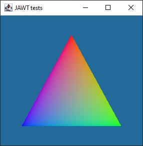
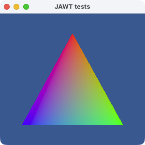
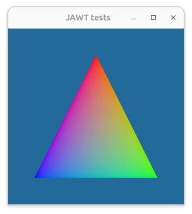

# `jawt-tests`

A simple application written in Kotlin and Rust that integrates WGPU and AWT using `jawt`. To run it, execute:

```
./gradlew :run
```

| Windows                                     | macOS                                   | Linux                                   |
| ------------------------------------------- | --------------------------------------- | --------------------------------------- |
|  |  |  |
